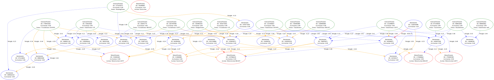

# Evolution Simulation

Just me trying some things with brains and evolution :)

## Brainzzz
Brain DOT graphs data in console can be visualized [here](https://dreampuf.github.io/GraphvizOnline/?engine=dot)

Currently, a brain can look something like this:
